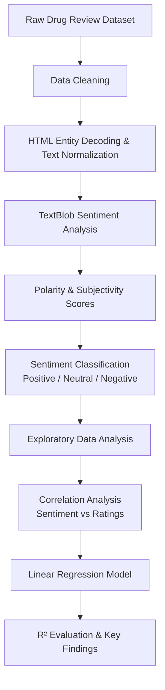
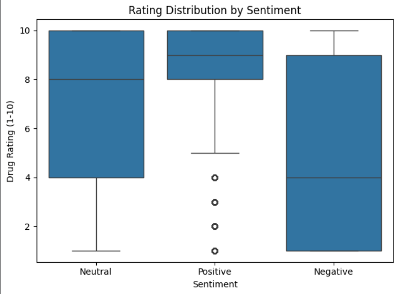
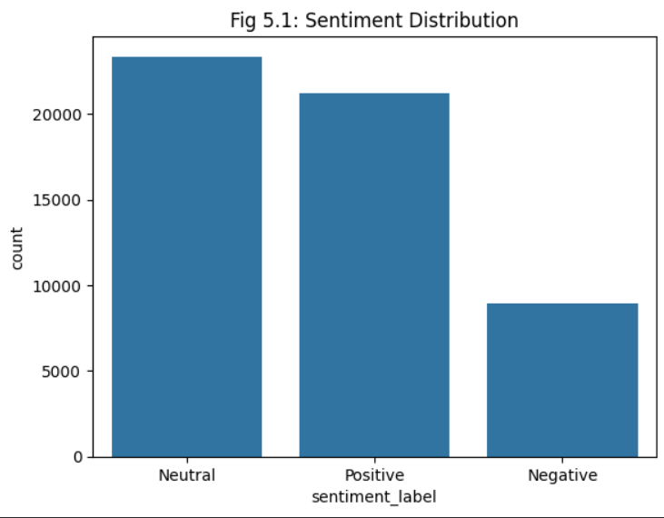
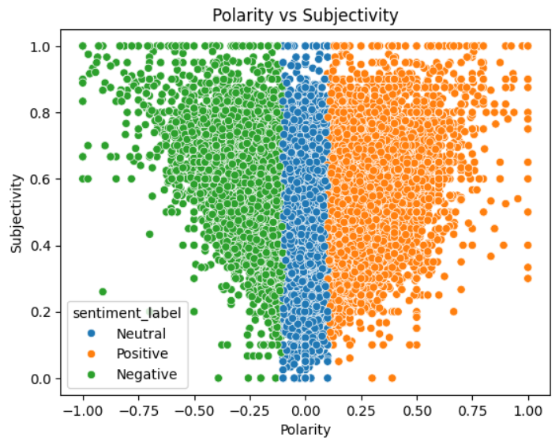

# Drug-Review-Sentiment-Analysis-Using-TextBlob-NLP

> Analyzing patient drug reviews to understand sentiment patterns and their relationship with user ratings, built with TextBlob and Python.

---

## Overview

This project applies Natural Language Processing to the [KUC Hackathon Winter 2018 Drug Review Dataset](https://www.kaggle.com/datasets/jessicali9530/kuc-hackathon-winter-2018) from Kaggle. Patient reviews are cleaned, processed, and analyzed using TextBlob to extract polarity and subjectivity scores. The reviews are then classified as Positive, Neutral, or Negative, and a Linear Regression model is used to explore whether sentiment polarity can predict user ratings.

The project demonstrates a complete NLP workflow, from raw text preprocessing and sentiment extraction to statistical analysis and model evaluation.

---

## Problem Statement

Online drug reviews contain a significant amount of unstructured text data. Extracting structured sentiment signals from this data can help identify how patients feel about specific medications and whether those feelings align with the ratings they assign. This project investigates that relationship using rule-based sentiment analysis and a simple regression model.

---

## Features

- Full text preprocessing pipeline (HTML decoding, normalization, cleaning)
- Sentiment classification (Positive / Neutral / Negative) using TextBlob polarity
- Subjectivity scoring alongside polarity extraction
- Correlation analysis between sentiment and user ratings
- Exploratory Data Analysis with visualizations
- Linear Regression to quantify predictive power of polarity on ratings
- R² evaluation for model assessment

---

## Project Workflow

---

## Tech Stack

| Library | Purpose |
|---|---|
| Python 3.x | Core language |
| Pandas | Data loading and manipulation |
| NumPy | Numerical operations |
| TextBlob | Sentiment polarity and subjectivity |
| Scikit-Learn | Linear Regression, R² scoring |
| Matplotlib | Visualizations |
| Seaborn | Statistical plots |

---

## Dataset

**Source:** [KUC Hackathon Winter 2018 — Drug Review Dataset](https://www.kaggle.com/datasets/jessicali9530/kuc-hackathon-winter-2018)

The dataset contains patient reviews of drugs sourced from Drugs.com, along with associated conditions, user ratings (1–10), and usefulness votes. It was originally compiled for the UCI ML Repository.

| Attribute | Detail |
|---|---|
| Reviews | ~215,000 patient entries |
| Rating scale | 1 to 10 |
| Key columns | `review`, `rating`, `condition`, `drugName` |

> Download the dataset from Kaggle and place it in the `data/` directory before running the notebook.

---

## Key Findings

- A positive relationship exists between TextBlob polarity scores and user ratings which shows reviews with higher polarity tend to receive higher ratings.
- Correlation analysis confirmed this trend across the dataset.
- The Linear Regression model achieved an **R² ≈ 0.115**, meaning sentiment polarity explains roughly 11.5% of the variance in ratings. This indicates a measurable but limited predictive relationship, which makes sense given that ratings are also influenced by factors like drug effectiveness, side effects, and individual expectations that text sentiment alone cannot capture.
- Sentiment classification revealed that the majority of reviews skew positive, consistent with typical online review behavior.

---

## Sample Visualizations

### Rating Distribution

The distribution shows how user ratings are spread across the dataset, providing insight into overall patient satisfaction trends.

### Sentiment Distribution

Reviews were classified as Positive, Neutral, or Negative using TextBlob polarity scores. The chart highlights the overall sentiment composition of the dataset.

### Polarity vs Subjectivity

This scatter plot illustrates the relationship between sentiment polarity and subjectivity, helping visualize how opinionated reviews vary across different sentiment levels.

---

## Future Improvements

- Compare lexicon-based sentiment analysis with transformer-based approaches such as DistilBERT.
- Build per-drug or per-condition sentiment breakdowns
- Use TF-IDF + classification models (SVM, Logistic Regression) for a more robust sentiment classifier
- Add an interactive dashboard (Streamlit or Gradio) for exploring reviews by drug or condition

---

## Learning Outcomes

- Understood how to preprocess real, noisy text data (HTML tags, special characters, encoding issues)
- Learned how TextBlob computes polarity and subjectivity using its built-in lexicon
- Practiced building a full NLP pipeline from scratch, including EDA and regression evaluation
- Gained a clearer understanding of R² and what "limited but measurable" predictive power looks like in practice
- Worked with a realistic, large-scale dataset rather than a toy example

---

## Author

**Arnav Agrawal**
B.Tech — Artificial Intelligence & Machine Learning
Symbiosis Institute of Technology, Pune

---

> This project was developed as part of coursework in Software Tools for Artificial Intelligence and Machine Learning (STAIML). The analysis is intentionally kept approachable and explainable which is  focused on understanding the data rather than chasing model performance.
